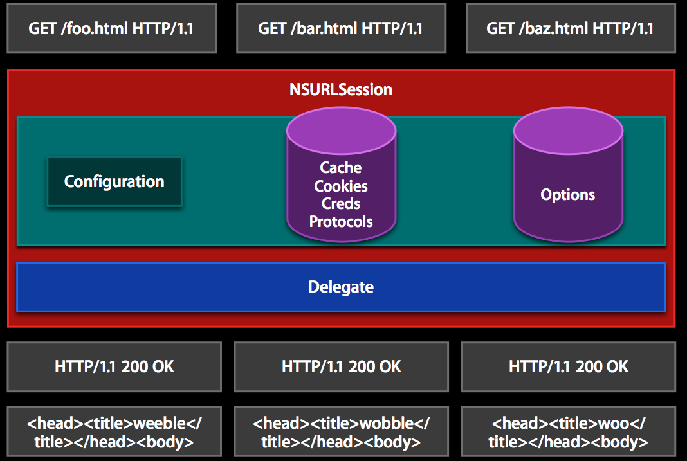

#NSURLSession学习
##简介
  iOS7(OS X v10.9)出现了NSURLSession。目的为了替换 NSURLConnection.对于后台APP，也提供后台下载功能。

##之前的NSURLConnection 
   NSURLConnection工作原理，如下图
  
  1. NSURLConnection 作为 Core Foundation / CFNetwork 框架的 API 之上的一个抽象,指代的 Foundation 框架的 URL 加载系统中一系列有关联的组件：***NSURLRequest、NSURLResponse、NSURLProtocol、 NSURLCache、 NSHTTPCookieStorage、NSURLCredentialStorage 以及同名类 NSURLConnection***。
  2.NSURLRequest 被传递给 NSURLConnection。被委托对象（遵守以前的非正式协议 <NSURLConnectionDelegate> 和 <NSURLConnectionDataDelegate>）异步地返回一个 NSURLResponse 以及包含服务器返回信息的 NSData。
  3.在一个请求被发送到服务器之前，系统会先查询共享的缓存信息，然后根据策略（policy）以及可用性（availability）的不同，一个已经被缓存的响应可能会被立即返回。如果没有缓存的响应可用，则这个请求将根据我们指定的策略来缓存它的响应以便将来的请求可以使用。
  4.在把请求发送给服务器的过程中，服务器可能会发出鉴权查询（authentication challenge），这可以由共享的 cookie 或机密存储（credential storage）来自动响应，或者由被委托对象来响应。发送中的请求也可以被注册的 NSURLProtocol 对象所拦截，以便在必要的时候无缝地改变其加载行为。
##NSURLSession
   NSURLSession工作原理，如下图
   
  1. NSURLSession包含之前NSURLSession关联的组件***NSURLRequest 与 NSURLCache***，把 NSURLConnection 替换成了 NSURLSession、NSURLSessionConfiguration 以及 NSURLSessionTask 的 3 个子类：NSURLSessionDataTask，NSURLSessionUploadTask，NSURLSessionDownloadTask。
  2.从NSURLConnection原理图和NSURLSession原理图分析，NSURLSession最大改进可以配置每个 session 的缓存，协议，cookie，以及证书策略（credential policy），甚至跨程序共享这些信息。这将允许程序和网络基础框架之间相互独立，不会发生干扰。每个 NSURLSession 对象都由一个 NSURLSessionConfiguration 对象来进行初始化，后者指定了刚才提到的那些策略以及一些用来增强移动设备上性能的新选项。

##补充网络辅助类
 

***
###认证和证书
***
针对认证和证书，URL加载系统提供了以下几个类：

NSURLCredential：封装了由认证信息和持久化行为组成的证书。
	web 服务可以在返回 http 响应时附带认证要求 challenge，作用是询问 http 请求的发起方是谁，这时发起方应提供正确的用户名和密码（即认证信息），然后 web 服务才会返回真正的 http 响应。
***
NSURLProtectionSpace：表示需要特定证书的区域。一个保护区域可以限制到单独的URL，拥有web服务器的区域，或引用一个代理。
***
NSURLCredientialStorage：一般是一个共享实例，用于管理证书存储和提供NSURLCredential对象到NSURLProductionSpace对象的映射。
***
NSURLAuthenticationChallenge：封装了认证一个请求的的NSURLProtocol实现所需要的信息：一个建议的证书、保护空间、错误信息或者协议用于确定所需要认证的响应、以及认证尝试次数等。初始对象（即请求发送者）必须实现NSURLAuthenticationChallengeSender协议。NSURLAuthenticationChallenge实例被用于NSURLProtocol的子类来告诉URL加载系统需要认证。他们同样为NSURLConnection和NSURLDownload的代理方法提供了便利的自定义认证处理。
  收到认证要求时，NSURLConnection 的委托对象会收到相应的消息并得到一个 NSURLAuthenticationChallenge 实例。该实例的发送方遵守 NSURLAuthenticationChallengeSender 协议。为了继续收到真实的数据，需要向该发送方向发回一个 NSURLCredential 实例。
  		     
             - (void)connection:(NSURLConnection *)connection                             didReceiveAuthenticationChallenge:(NSURLAuthenticationChallenge *)challenge
			{
    // 之前已经失败过
    if ([challenge previousFailureCount] > 0) {
       
        // 为什么失败
        NSError *failure = [challenge error];
        NSLog(@"Can't authenticate:%@", [failure localizedDescription]);
        
        // 放弃
        [[challenge sender] cancelAuthenticationChallenge:challenge];
        return;
    }
    
    // 创建 NSURLCredential 对象
    NSURLCredential *newCred = [NSURLCredentialcredentialWithUser:@"sid"
                                                          password:@"MomIsCool"
                                                       persistence:NSURLCredentialPersistenceNone];
    
    // 为 challenge 的发送方提供 credential
    [[challenge sender] useCredential:newCred
           forAuthenticationChallenge:challenge];
}
###缓存管理
URL加载系统提供基于磁盘和内存的缓存，允许程序减少对网络连接的依赖，并提供对缓存响应的快速访问。缓存存储在每个app的缓存文件夹下。NSURLConnection会根据缓存策略（初始化NSURLRequest对象中指定的）来查询缓存。
NSURLCache提供了配置缓存大小和磁盘存储位置的方法。同时提供了包含缓存响应的NSCacheURLResponse对象集合的方法。NSCacheURLResponse对象封装了NSURLResponse对象和URL数据，同时提供用户信息字典，这些信息可以用于缓存任何用户数据。
不是所有的协议实现都支持响应缓存。当前只有http和https请求可被缓存。
一个NSURLConnection对象可以通过connection:willCacheResponse:代理访求来控制是否缓存响应，响应是否只应该存储在内存中。

###Cookie存储
由于HTTP协议是无状态的，所以客户端通常使用cookie来保存URL请求的数据。URL加载系统提供了接口来创建和管理cookie，将cookie作为HTTP请求的一部分来发送，及解析web服务端响应数据时接收cookie.

iOS提供了NSHTTPCookieStorage类来管理一个NSHTTPCookie对象的集合。

###协议支持
URL加载系统默认支持http, https, file, ftp, data协议。另外，URL加载系统也允许我们注册自己的类来支持额外的系统层级的网络协议。我们也可以添加指定协议的属性到URL请求和URL响应对象

  
  
##参考内容
  1.<https://www.objc.io/issues/5-ios7/from-nsurlconnection-to-nsurlsession/> 
  2.<http://hayageek.com/ios-nsurlsession-example/#session-types> 
  3.<https://www.raywenderlich.com/110458/nsurlsession-tutorial-getting-started>