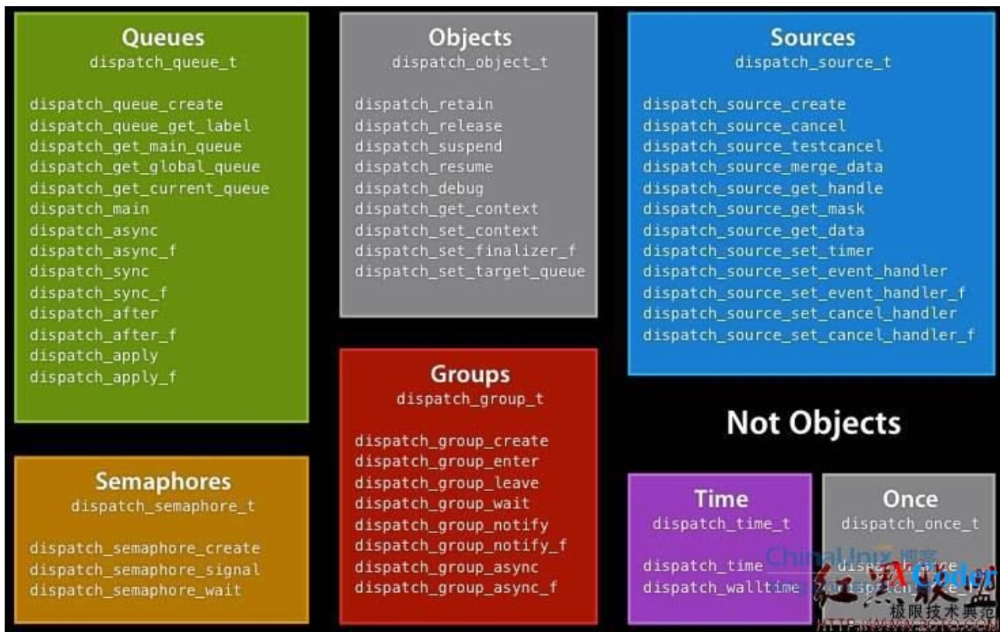

#GCD回顾系列之概论

###什么是GCD

&emsp;&emsp;GCD全称 Grand Central Dispatch,属于**系统级的线程管理**,提供了一种新的方法进行并发程序编写,是一套底层API。另外，GCD这块已经开源，地址<http://libdispatch.macosforge.org>。 
   
&emsp;&emsp;***从基本功能上讲***，GCD将程序将任务切分为多个单一任务然后提交至工作队列来并发地或者串行地执行。GCG相对与NSOpertionQueue更底层更高效，并且它不是Cocoa框架的一部分。 
&emsp;&emsp;除了代码的平行执行能力，GCD还提供 ***高度集成的事件控制系统***。可以设置句柄来响应文件描述符、mach ports（Mach port 用于 OS X上的进程间通讯）、进程、计时器、信号、用户生成事件。这些句柄通过GCD来并发执行。 
&emsp;&emsp;***从函数角度上讲***，GCD的API很大程度上基于block，当然，GCD也可以脱离block来使用，比如使用传统c机制提供函数指针和上下文指针。实践证明，当配合block使用时，GCD非常简单易用且能发挥其最大能力。

###为什么使用？
***易用性***: GCD比之thread跟简单易用。由于GCD基于work unit而非像thread那样基于运算，所以GCD可以控制诸如等待任务结束、监视文件描述符、周期执行代码以及工作挂起等任务。基于block的血统导致它能极为简单得在不同代码作用域之间传递上下文。 

***效率性***: GCD被实现得如此轻量和优雅，使得它在很多地方比之专门创建消耗资源的线程更实用且快速。这关系到易用性：导致GCD易用的原因有一部分在于你可以不用担心太多的效率问题而仅仅使用它就行了。 

***性能性***: GCD自动根据系统负载来增减线程数量，这就减少了上下文切换以及增加了计算效率。 

###家族体系

参考文章：
1.<http://www.dreamingwish.com/article/grand-central-dispatch-basic-1.html>