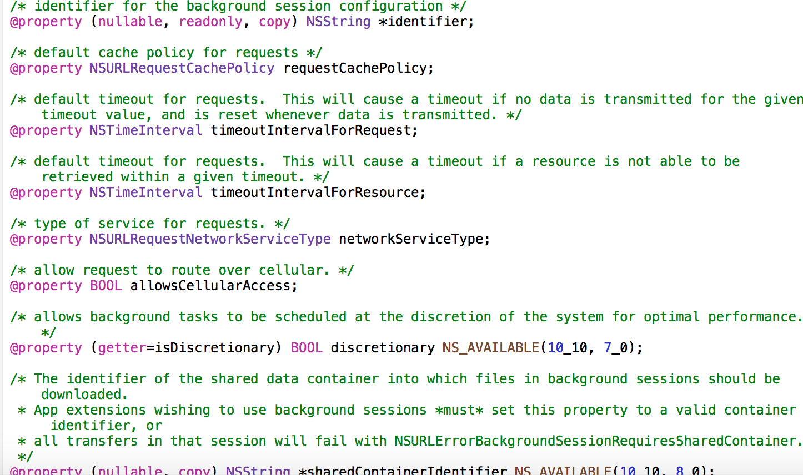
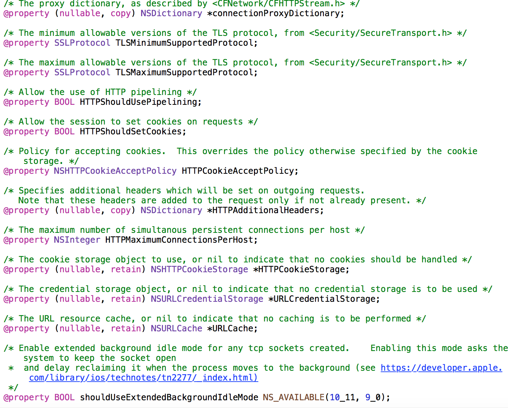
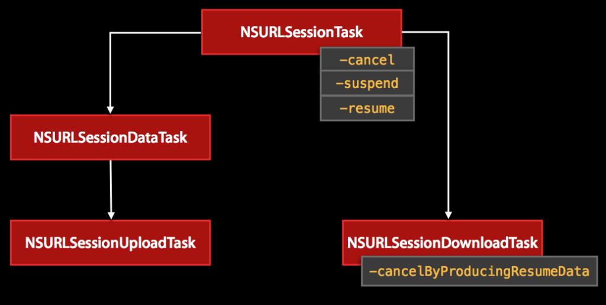
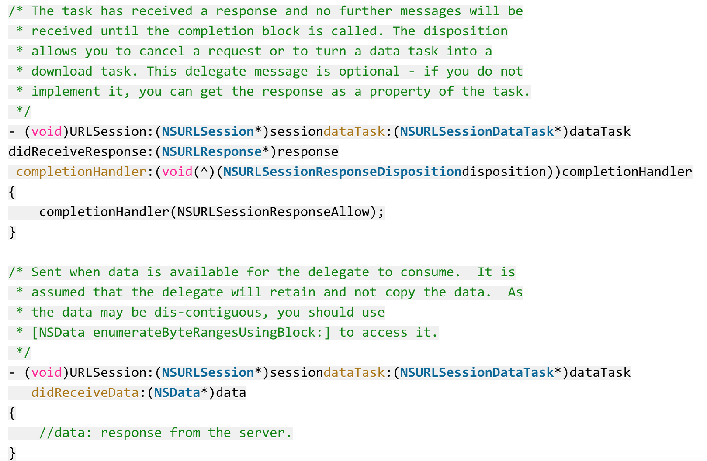
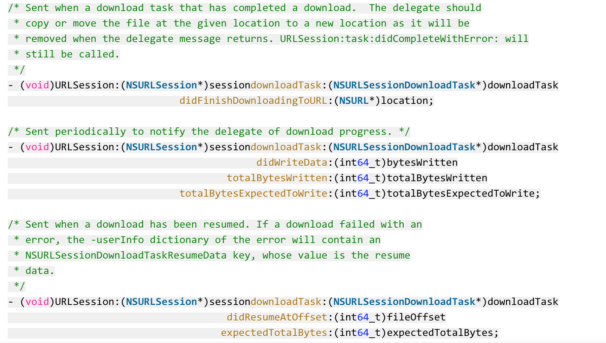

#NSURLSession擒拿法

>这一节主要讲解NSURLSession使用

#NSURLSession结构图
  
 
#NSURLSessionConfiguration
  NSURLSessionConfiguration对象用于初始化NSURLSession对象。请求级别上与NSMutableURLRequest相关可供选择方案。它对于会话如何产生请求，做了相当多的控制与灵活度。从网络访问性能，到cookie，安全性，缓存策略，自定义协议，启动事件设置，以及用于移动设备优化的几个新属性,如下图
 
 
 
  
  
###Properties

######Caching Policies
　　URLCache 是会话使用的缓存。默认情况下，NSURLCache 的+ sharedURLCache 会被使用，这与NSURLConnection是相同的。 
　　***requestCachePolicy*** 指定了一个请求的缓存响应应该在什么时候返回。这相当于NSURLRequest 的-cachePolicy方法。
######General
  ***timeoutIntervalForRequest 和 timeoutIntervalForResource***指定了请求以及该资源的超时时间间隔。 
  ***networkServiceType***对标准的网络流量，网络电话，语音，视频，以及由一个后台进程使用的流量进行了区分。大多数应用程序都不需要设置这个。 
  ***allowsCellularAccess 和 discretionary***被用于节省通过蜂窝连接的带宽。建议在使用后台传输的时候，使用discretionary属性，而不是allowsCellularAccess属性，因为它会把WiFi和电源可用性考虑在内。 
  ***sharedContainerIdentifier***它给NSURLSession使用的共享容器（用于缓存分享内容）指定了一个名称，这个容器也是扩展载体应用的一部分 
  ***sessionSendsLaunchEvents*** 是另一个新的属性，该属性指定该会话是否应该从后台启动。 
  ***HTTPAdditionalHeaders***指定了一组默认的可以设置出站请求的数据头。 
  ***HTTPMaximumConnectionsPerHost*** 是 Foundation 框架中URL加载系统的一个新的配置选项。它曾经被用于NSURLConnection管理私人连接池。现在有了NSURLSession，开发者可以在需要时限制连接到特定主机的数量。 
  ***HTTPShouldUsePipelining*** 也出现在NSMutableURLRequest，它可以被用于开启HTTP管道，这可以显着降低请求的加载时间，但是由于没有被服务器广泛支持，默认是禁用的。 
  ***connectionProxyDictionary***指定了会话连接中的代理服务器。 
######Cookie Policies
  ***HTTPCookieStorage*** 是被会话使用的cookie存储。默认情况下，NSHTTPCookieShorage的+ sharedHTTPCookieStorage会被使用，这与NSURLConnection是相同的。 
　***HTTPCookieAcceptPolicy*** 决定了该会话应该接受从服务器发出的cookie的条件。 
　***HTTPShouldSetCookies*** 指定了请求是否应该使用会话HTTPCookieStorage的cookie。 
######Security Policies
　　***URLCredentialStorage*** 是会话使用的证书存储。默认情况下，NSURLCredentialStorage 的+ sharedCredentialStorage 会被使用使用，这与NSURLConnection是相同的。
　　***TLSMaximumSupportedProtocol 和 TLSMinimumSupportedProtocol*** 确定是否支持SSLProtocol版本的会话。
######Custom Protocols
　　***protocolClasses***是注册NSURLProtocol类的特定会话数组。
　　
###Constructors
  
一般模式（default）：工作模式类似于原来的NSURLConnection，可以使用缓存的Cache，Cookie，鉴权。 
及时模式（ephemeral）：不使用缓存的Cache，Cookie，鉴权。 
后台模式（background）：在后台完成上传下载，创建Configuration对象的时候需要给一个NSString的ID用于追踪完成工作的Session是哪一个。 

# NSURLSession Tasks and Delegates

###NSURLSessionDataTask
   Note:不支持后台模式
#####创建Data task(使用系统提供的代理)
 
 
#####创建Data task(自定义代理代理)
 

###NSURLSessionDownloadTask
 Note:直接写入临时文件内，支持后台下载
 #####创建Data task(使用系统提供的代理)
 
 
#####创建Data task(自定义代理代理)
 
  

###NSURLSessionUploadTask
 Note:支持后台下载
 #####创建Data task(使用系统提供的代理)
 
 
#####创建Data task(自定义代理代理)
 
 
 

##HTTP使用
####步骤
1.创建Session Configuration
2.创建NSURLSession Object
3.创建NSURLSession Task（data,download,upload）
4.resume

   