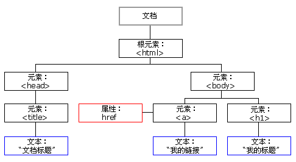

#DOM

##什么是DOM
 文档对象模型（Document Object Model，简称DOM）；在网页上，组织页面（或文档）的对象被组织在一个树形结构中，用来表示文档中对象的标准模型就称为DOM。
 
 
##DOM树

- 整个文档是一个文档节点 
- 每个 HTML 标签是一个元素节点 
- 包含在 HTML 元素中的文本是文本节点 
- 每一个 HTML 属性是一个属性节点 
- 注释属于注释节点 
- Node 层次 
- 节点彼此都有等级关系。 

###节点遍历
#####node:
parentNode; 父节点
firstChild;lastChild; 子节点
previousSibling;nextSibling; 兄弟节点

###节点类型
节点包括以下信息：[nodeName、nodeValue 以及 nodeType]  
注释：nodeName 所包含的 XML 元素的标签名称永远是大写的 

- 元素节点  [标签名称，null，1]
- 属性节点  [属性名称，属性值，2]
- 文本节点  [#text,包含文本，3]
- 注释节点   [#comment，注释文本，8]
- 文档类型节点 [#document,null，9]

###元素遍历
1.子孙关系

+ firstElementChild;
+ lastElementChild;

2.兄弟关系

+ nextElementSibling
+ previousElementSibling

###节点操作
#####获取节点
1.父子关系

+ parentNode;
+ firstChild / lastChild / childNodes
+ childNodes / children

2.兄弟关系

+ previousSibling / nextSilbing
+ previousElementSiling / nextElementSiling

***Node*** 1，2方式获取节点***可维护性差***

3.接口方式获取节点

- document.getElementById   
- collection = element.getElementsByTagName  

	在此基础山通过下标获取某个元素  
	传入 * 获取element下所有的元素 
	返回动态集合，live

- collection = element.getElementsByClassName

    一个元素可以有多个类名 
    返回动态集合，live

- list = element.querySelector/All

   返回的list是静态的，如果之前有 remove node操作  不影响
   
   
#####创建节点
- element = document.createElement(tagName);

#####修改节点

- element.textContent   (IE9以下不支持)
- element.innerText    （不规范，ff不支持）

#####插入节点
- var achild = element.appendChild(achild);
- var achild = element.insertBefore(achild,refenceChild);

#####删除节点
- var child = element.removeChild(child);

####innerHTML

- element.innerHTML();

    节点HTML内容，提高开发效率 
    内存泄露，之前设置的事件被清掉 
    安全问题，html不检查内容
    仅建议新的节点  不涉及用户的信息

NOTE:***节点以及其后代节点的文本内容*** 
 

 
 
 DOM Core
 DOM HTML
 DOM Style
 DOm Event